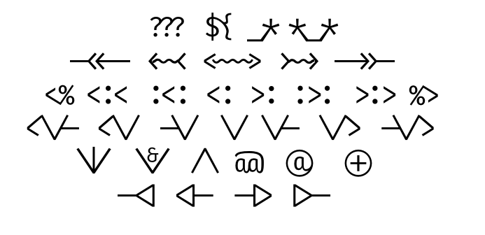

## Fira Lorde: unprincipled scala/scalaz ligatures hacked onto Fira Code

I want some scala/scalaz ligatures.

I like [Fira Code](https://github.com/tonsky/FiraCode/).

So this then.



### Code examples

Scala:


### Generating calt

```sh
> mvn dependency:get -Dartifact=org.clojure:clojure:1.8.0:jar
> ./gen_calt.clj
```

Paste the result into Font Info / Features / calt, careful to only replace the generated calt section.


